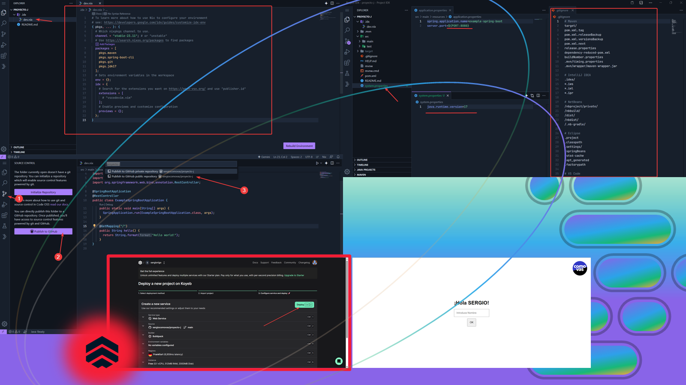

>> En esta investigación he explorado las capacidades del novedoso IDE en la nube **Google for Developers IDX**, tan versátil que puede trabajar con proyectos en lenguaje de programación Java sin instalar nada en tu PC. Aprovechando las ventajas de este entorno, he optado por utilizar el framework **Spring Boot** para el desarrollo de la aplicación, la cual será desplegada en la plataforma **Koyeb**, similar a Heroku, para su puesta en producción.

Google ha lanzado IDX para todos los usuarios, proporcionando una experiencia similar a un IDE tradicional, como **VISUAL STUDIO CODE**, pero con la ventaja de trabajar directamente en la nube. Al final del artículo encontrarás enlaces útiles, incluido el de registro para Google IDX.

Aunque GOOGLE IDX ofrece múltiples plantillas para iniciar proyectos rápidamente, carece de plantillas específicas para Spring Boot. Sin embargo, los usuarios pueden crear un proyecto desde cero y adaptar los archivos necesarios para trabajar con Spring Boot.

```NIX
# Archivo dev.nix
# To learn more about how to use Nix to configure your environment

# see: <https://developers.google.com/idx/guides/customize-idx-env>

{ pkgs, ... }: {

# Which nixpkgs channel to use

  channel = "stable-23.11"; # or "unstable"

# Use <https://search.nixos.org/packages> to find packages

  packages = [
    pkgs.maven
    pkgs.spring-boot-cli
    pkgs.git
    pkgs.jdk17
  ];

# Sets environment variables in the workspace

  env = {};
  idx = {
    # Search for the extensions you want on <https://open-vsx.org/> and use "publisher.id"
    extensions = [
      # "vscodevim.vim"
    ];
    # Enable previews and customize configuration
    previews = {};
  };
}
```

**En cada nuevo proyecto de Google IDX, existe un archivo dev.nix que permite personalizar el entorno añadiendo los paquetes que necesites.** Por ejemplo, para un proyecto Spring se incluirían las configuraciones básicas mostradas en el bloque de código de arriba. Para otros tipos de proyectos como Node o PHP, sería conveniente ajustar también la vista previa (previews) en este archivo de configuración.

**Primeros pasos desde comenzar el proyecto hasta subir los archivos.**
Para iniciar un proyecto Spring, primero obtén los archivos desde Initializr. Puedes encontrar la documentación necesaria y un enlace útil para desplegar tu aplicación en Koyeb, una plataforma que permite el despliegue gratuito y sin requerir datos de tarjeta de crédito, lo cual es de agradecer, al final del artículo. Una vez generado tu código con Initializr, descomprime el archivo y mueve los archivos resultantes a IDX, similar a cómo gestionarías archivos en una carpeta de Windows.


**Modifica el proyecto, usa GitHub y haz "deploy" para ver tu web/api final ya publicada.**
Si aún no has actualizado tu archivo dev.nix, hazlo ahora. Luego, añade los archivos necesarios para compartir y mostrar tu proyecto a amigos o clientes. En el caso de Koyeb necesitarás modificar el application.properties, el .gitignore, y crear un system.properties. Por último, prepara el contenido de tu proyecto; por ejemplo, puedes copiar el esquema básico disponible en mi repositorio de GitHub donde también encontrarás el contenido de los archivos anteriormente mencionados.

Para finalizar, despliega tu proyecto en dos pasos: primero, sube el proyecto de IDX a GITHUB con las herramientas del IDE. Luego, en KOYEB, crea una cuenta, selecciona tu proyecto de GITHUB y haz clic en desplegar. Ten en cuenta que si KOYEB no registra actividad, suspenderá tu proyecto, requiriendo que lo reactives manualmente en su sitio web.



Siguiendo estos pasos, podrás lanzar una aplicación, API o web en pocos minutos. Por mi parte me apetece mucho el mejorar mi ejemplo básico para incrementar su complejidad, ya que esta combinación de tecnologías me facilitará enormemente dar vida a las ideas de mis proyectos durante mi tiempo libre. 

Y hasta aquí mi artículo por hoy. Agradezco tu atención. Si eres un reclutador, te invito a explorar mi sitio web personal, comovas.es, donde descubrirás ejemplos adicionales y artículos que demuestran cómo mis habilidades pueden beneficiar a tu empresa así como enlaces directos a mi currículum y experiencia en gestión de equipos y personal.

| Descripción | Enlace |
|---|---|
| Primeros Pasos Koyeb | [https://www.koyeb.com/docs/deploy/spring-boot](https://www.koyeb.com/docs/deploy/spring-boot) |
| Google IDX | [https://idx.dev/](https://idx.dev/) |
| Repositorio GITHUB completo | [https://github.com/PayamDiba/SERGIO](https://github.com/PayamDiba/SERGIO) |
| Servicio acabado y publicado | [https://www.koyeb.com/](https://www.koyeb.com/) |
| Página web personal | [https://www.quora.com/What-does-the-Spanish-phrase-c%C3%B3mo-se-va-mean](https://www.quora.com/What-does-the-Spanish-phrase-c%C3%B3mo-se-va-mean) |
